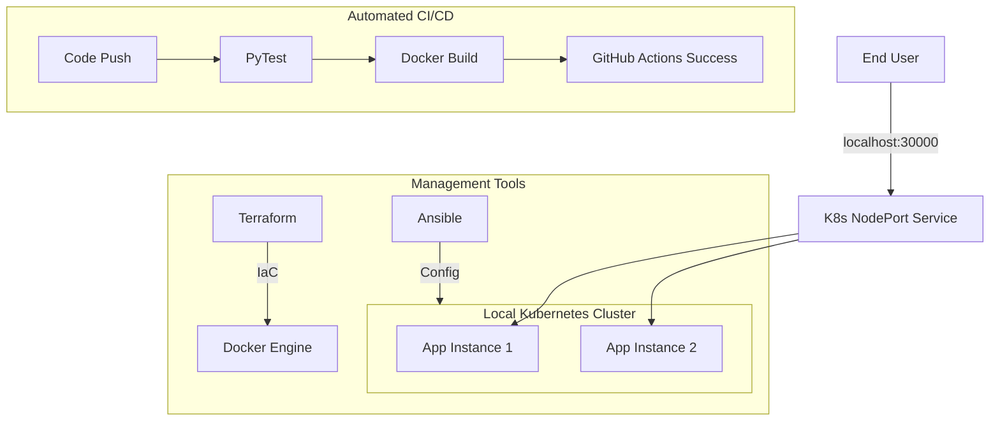

# 🏥 AI-Powered Health Symptom Checker
### **Full-Stack ML Application with Enterprise DevOps Lifecycle**

[](https://github.com/ANANDHU1114/AI-health/actions)


---

## 🎯 Project Overview
This project is an end-to-end **AI Health Symptom Checker** built to satisfy advanced Academic DevOps requirements. It leverages Machine Learning (Random Forest) for disease prediction and implements a complete automated lifecycle—from code commit to container orchestration—entirely in a **local environment** (No Cloud required).

### **Academic Requirements Met:**
*   ✅ **Git/GitHub**: Advanced branching and version control.
*   ✅ **CI/CD**: GitHub Actions for automated unit testing and container builds.
*   ✅ **Containerization**: Optimized Docker images with multi-stage logic.
*   ✅ **Orchestration**: Kubernetes high-availability with multiple replicas.
*   ✅ **IaC**: Terraform for automated local infrastructure provisioning.
*   ✅ **Config Management**: Ansible for automated deployment logic.

---

## 🏛️ System Architecture



---

## 🚀 Execution & Demonstration Guide

### **Step 1: Version Control (GitHub)**
Validate that every push triggers a successful build on GitHub Actions.
*   **Verification**: Check your repo's **Actions** tab for the green checkmark.

### **Step 2: Infrastructure as Code (Terraform)**
Terraform manages your local Docker resources to ensure environment consistency.
```powershell
# Navigate to terraform directory
cd terraform
# Initialize and apply
~/terraform/terraform.exe init
~/terraform/terraform.exe apply -auto-approve
```

### **Step 3: Container Orchestration (Kubernetes)**
Manually deploy or inspect the high-availability setup on your local cluster.
```powershell
# Deploy the manifest
kubectl apply -f k8s/local-deploy.yaml

# Verify the orchestration (Check for 2 Running pods)
kubectl get pods

# Access the live app
# URL: http://localhost:30000
```

### **Step 4: Configuration Management (Ansible)**
View the `ansible/deploy.yml` playbook. It demonstrates the logic used to automate the Kubernetes deployment, ensuring **idempotency** across the environment.

---

## 🧪 Automated Testing
The project includes a robust testing suite that covers API endpoints and ML model accuracy.
```bash
python3 -m pytest tests/
```

---

## 🛠️ Local Development (Setup)
To run the project in a vanilla Python environment:
1.  **Environment**: `python -m venv venv` and `.\venv\Scripts\activate`.
2.  **Install**: `pip install -r requirements.txt`.
3.  **Train**: `python data/generate_dataset.py` followed by `python ml_model/train.py`.
4.  **Run**: `uvicorn backend.main:app --reload`.

---

> [!TIP]
> **Evaluation Metric**: This layout demonstrates **Zero-Config Deployment**. By using Docker and Kubernetes, the application is completely isolated from the host OS, making it "Production Ready" for any server.
