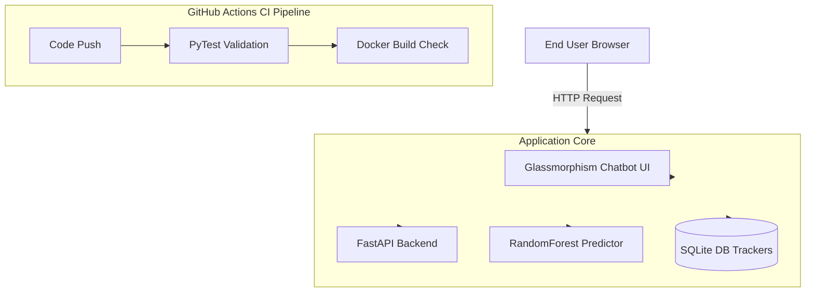

# AI-Powered Health Symptom Checker

An advanced, full-stack application utilizing Machine Learning (Random Forest + TF-IDF) to predict diseases from symptom prompts. This application is designed to be fully containerized using Docker for easy deployment and testing.

---

## 🏛️ Architecture



---

## 🚀 Key Features

1. **AI Chatbot**: Utilizes Scikit-learn NLP extraction resolving disease probabilities.
2. **Audio Dictation**: Integrated Web Speech API for voice-to-text symptom input.
3. **JWT Authentication**: Secure user login and history tracking.
4. **DevOps Engine**: Fully containerized with Docker and automated testing via GitHub Actions.

---

## 🛠️ How to Run the Project

### Phase 1: Local Development
To run the app directly on your machine:
```bash
# 1. Setup virtual environment
python -m venv venv
.\venv\Scripts\activate

# 2. Install dependencies
pip install -r requirements.txt

# 3. Generate data & Train model
python data/generate_dataset.py
python ml_model/train.py

# 4. Start the app
uvicorn backend.main:app --reload
```
Access the app at `http://127.0.0.1:8000`.

### Phase 2: Docker Containerization
To run the application inside a container:
```bash
# 1. Build the image
docker build -t ai-symptom-checker .

# 2. Run the container
docker run -d -p 8000:8000 ai-symptom-checker
```
The app will be available at `http://localhost:8000`.

### Phase 3: Continuous Integration (CI)
Every push to the `main` branch triggers a GitHub Actions pipeline that:
1. Installs all dependencies.
2. Trains the ML model to ensure training logic is sound.
3. Runs all unit tests (`pytest`).
4. Builds the Docker image to ensure the container is production-ready.

---

## 🧪 Testing
Run the automated test suite with:
```bash
pytest tests/
```
