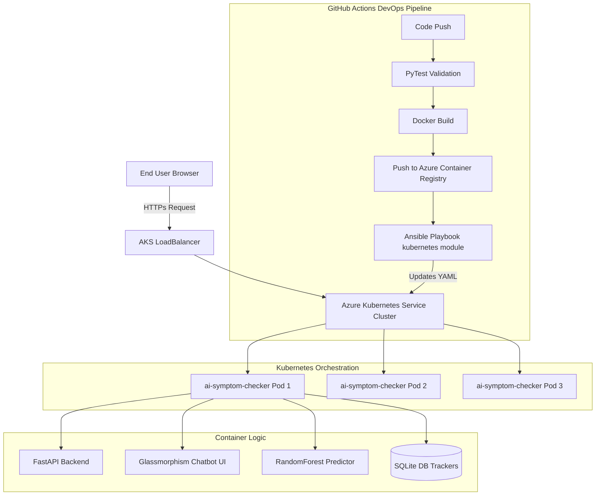

# AI-Powered Health Symptom Checker - Enterprise Edition

An advanced, full-stack enterprise application utilizing Machine Learning (Random Forest + TF-IDF) to predict diseases from symptom prompts. Deployed securely utilizing a completely containerized architecture mapped via Azure DevOps (ACR, AKS, Terraform & Ansible).

---

## 🏛️ Architecture Diagram



---

## 🚀 Key Features

1. **AI Chatbot**: Utilizes Scikit-learn NLP extraction resolving disease probabilities.
2. **Audio Dictation**: Web Speech API integration.
3. **JWT Authentication**: Full-stack login modals managing encrypted localized data tracking.
4. **DevOps Engine**: Implements Terraform resource definitions resolving deeply towards active Azure ecosystems.

---

## 🛠️ Step-by-Step DevOps Implementation

### Phase 1: Local Development & Training
Create your virtual Python environment, install data-science libraries, and autonomously formulate your ML vectors.
```bash
python -m venv venv
# Windows: .\venv\Scripts\activate
# Linux/Mac: source venv/bin/activate
pip install -r requirements.txt
python data/generate_dataset.py
python ml_model/train.py
```
*Screenshot Placeholder: [Terminal showing Train complete 98% accuracy]*

### Phase 2: Docker Containerization
Optimized `Dockerfile` wrapping the backend and localized Frontend elements simultaneously.
```bash
# Build the Container Model
docker build -t ai-symptom-checker:latest .

# Verify Application Stability pre-deployment
docker run -d -p 8000:8000 ai-symptom-checker
```

### Phase 3: Terraform (Infrastructure as Code)
Azure cloud mapping natively handled utilizing HCL logic establishing your ACR repo and AKS clustering nodes. Ensure you are signed into the `az cli` prior.
```bash
cd terraform/
terraform init
terraform plan
terraform apply -auto-approve
```
*Screenshot Placeholder: [Terraform Apply Complete showing Outputs]*

### Phase 4: CI/CD Execution
Pushing your code entirely automates testing metrics in `.github/workflows/ci.yml`. The cloud runners simulate Ansible abstraction pushing Kubernetes configs dynamically.

### Phase 5: Cluster Validation
Verify you are securely connected to Azure K8s via Azure CLI, then track your Load Balancer configurations directly:
```bash
# Verify your 3 Pod Replicas are Running
kubectl get pods

# Note: Extract your EXTERNAL-IP from this command to access the live web app!
kubectl get svc ai-symptom-checker-service
```
*Screenshot Placeholder: [Terminal showing kubectl get svc with public IP string]*

Access your fully scaled application utilizing your new public Azure External-IP!
